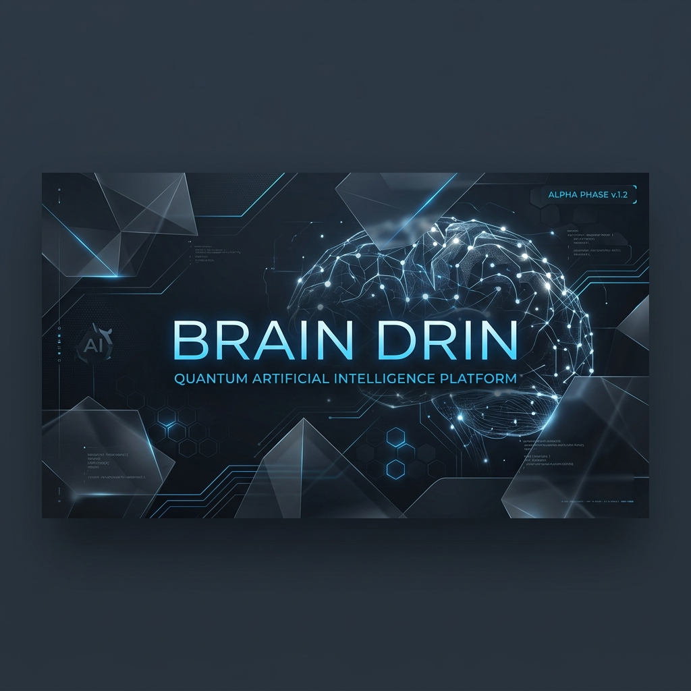

# Brain Drin



**Portable agent suite for Claude Code.** 51 agents, 52 commands, 100 skills — ready to deploy on any project.

Curated from the best open-source Claude Code resources: [wshobson/claude-code-agents](https://github.com/wshobson/claude-code-agents), [qdhenry/claude-commands](https://github.com/qdhenry/claude-commands), [BMAD-METHOD](https://github.com/bmad-method/BMAD-METHOD), [VoltAgent](https://github.com/VoltAgent/awesome-claude-code), and Anthropic's own documentation.

---

## What's Inside

### Agents (51)

Specialized personas that Claude adopts for focused work.

| Domain | Agents |
| :--- | :--- |
| Strategy & Leadership | `team-lead` `cto-advisor` `strategist` `founder-coach` `product-manager` `project-manager` `scrum-master` |
| Engineering | `code-architect` `fullstack-dev` `backend-dev` `frontend-dev` `mobile-dev` `database-architect` `api-designer` |
| Languages | `typescript-pro` `python-expert` `rust-engineer` `go-specialist` |
| Infra & Ops | `devops-engineer` `kubernetes-pro` `terraform-pro` `sre-engineer` `cloud-architect` |
| Data & AI | `data-scientist` `ml-engineer` `data-engineer` `prompt-engineer` `business-analyst` |
| Marketing & Sales | `growth-hacker` `content-marketer` `sales-automator` `sdr-manager` `sales-ops` `seo-specialist` `social-media-manager` `community-manager` `copywriter` |
| Quality & Security | `code-reviewer` `security-auditor` `qa-lead` `test-engineer` `performance-analyst` `legal-compliance` `debugger` |
| Research & Content | `researcher` `technical-writer` `writer` `ux-writer` `user-researcher` `ux-designer` `customer-success` |

### Commands (52)

Slash commands (`/command`) for specific workflows: `onboard`, `feature-dev`, `review-pr`, `session-handoff`, `debug`, `refactor`, `security-audit`, `db-opt`, `test-gen`, `doc-gen`, and 42 more.

### Skills (100)

Reusable multi-step workflows: API scaffolding, competitor intelligence, churn analysis, chaos engineering, lead scoring, terraform repair, prompt debugging, and more. All prefixed `drin-*`.

### Memory Compiler

Python-based session persistence (`.drin/memory-compiler/`). Hooks into Claude Code lifecycle to save decisions and context between sessions. Requires `uv`.

---

## Install

Clone the repo and run the installer from your target project:

```bash
git clone https://github.com/pedrol-cmd/brain-drin.git
cd your-project
bash /path/to/brain-drin/setup.sh
```

The script copies agents, commands, skills, and protocol files into your project's `.claude/` directory. If `.claude/` already exists, it backs it up first.

For the memory compiler:
```bash
cd .drin/memory-compiler && uv sync
```

---

## Usage

1. **Direct agent**: `@code-reviewer review this PR` — activates the specialist
2. **Slash command**: `/onboard` — maps architecture of current project
3. **Orchestrator**: `@team-lead plan the migration` — decomposes complex tasks across agents
4. **Session persistence**: `/session-handoff` — saves context for next conversation

Read [CORE-PROTOCOL.md](./CORE-PROTOCOL.md) for the full efficiency guide.

---

## Sources

| Repo | What it contributed |
| :--- | :--- |
| [wshobson/claude-code-agents](https://github.com/wshobson/claude-code-agents) | Agent personas and command templates |
| [qdhenry/claude-commands](https://github.com/qdhenry/claude-commands) | Command structure and workflows |
| [BMAD-METHOD](https://github.com/bmad-method/BMAD-METHOD) | Product planning skills and methodology |
| [VoltAgent/awesome-claude-code](https://github.com/VoltAgent/awesome-claude-code) | Skill patterns and agent orchestration |
| [Anthropic Docs](https://docs.anthropic.com/en/docs/claude-code) | Claude Code best practices |

---

## License

[MIT](./LICENSE)
